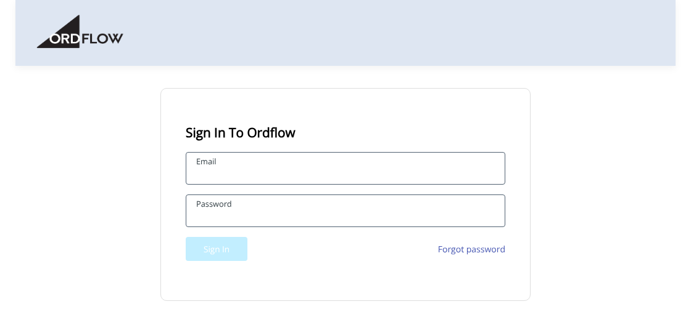
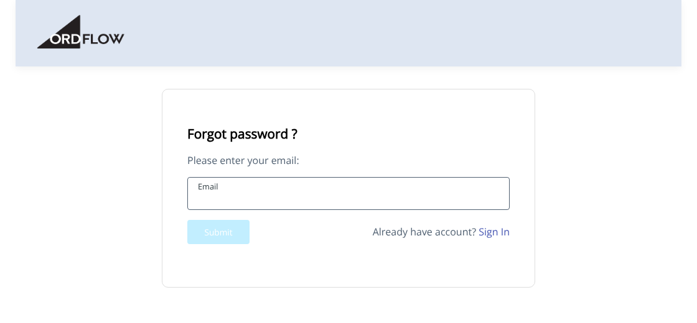

# Logging in

## Sign in

1. Go to [app.ordflow.com](https://app.ordflow.com). You'll see the **Sign In To Ordflow** screen.
2. Enter your **Email**.
3. Enter your **Password**.
4. Click **Sign In**. The button turns active once both fields are filled in.

<button class="hotspot" style="left:24.5%;top:52.5%" data-tip="Enter the email address of your Ordflow account">1</button>
<button class="hotspot" style="left:24.5%;top:65.8%" data-tip="Enter your password">2</button>
<button class="hotspot" style="left:24.5%;top:77.7%" data-tip="Click Sign In">3</button>
<button class="hotspot" style="left:76%;top:77.7%" data-tip="Forgot your password? Click here">4</button>

## Forgot your password?

1. On the sign-in screen, click **Forgot password**.
2. Enter your **Email** and click **Submit**.
3. Check your mailbox and follow the instructions in the email to set a new password.

<button class="hotspot" style="left:24.5%;top:59.8%" data-tip="Enter the email address of your Ordflow account">1</button>
<button class="hotspot" style="left:24.5%;top:71.7%" data-tip="Click Submit">2</button>

!!! tip "Remembered it?"
    Click **Sign In** next to *Already have account?* to go back to the sign-in screen.

**Next:** [The dashboard →](dashboard.md)
