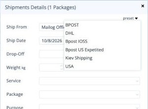
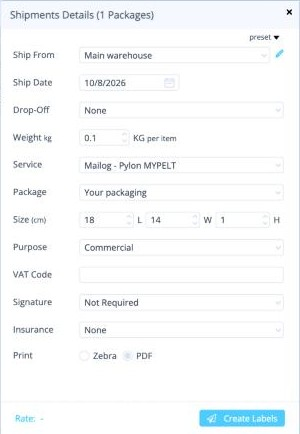
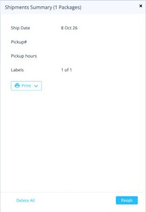
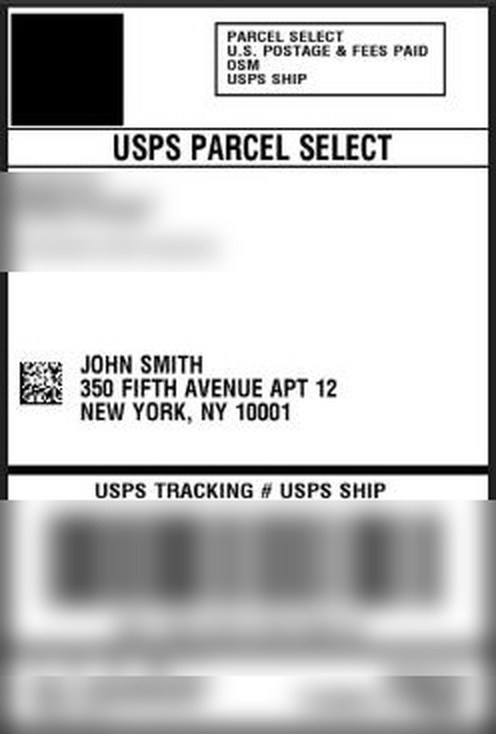

# Create shipping labels

You can create labels for one order or for many orders at once.

This page shows a Standard shipment. For Express, see also [Express shipments](express.md).

!!! warning "Check the rules first"
    Each destination has its own service, and some orders need to be split. Read the [shipping rules](rules.md) before you create labels for several orders together.

## 1. Select the orders

On the [orders board](index.md), tick the box on each order you want to ship. Then click **Ship** in the toolbar.

## 2. Choose a preset

The **Shipments Details** panel opens on the right. Click **preset** at the top right and choose one of your [presets](../setup/presets.md). The fields fill in automatically.

<button class="hotspot" style="left:72%;top:8.5%" data-tip="Choose a preset">1</button>
<button class="hotspot" style="left:75%;top:31.6%" data-tip="Weight PER ITEM, not per package">2</button>
<button class="hotspot" style="left:96%;top:37.8%" data-tip="Shipping service">3</button>
<button class="hotspot" style="left:96%;top:63%" data-tip="Filled in automatically for EU (IOSS) shipments">4</button>
<button class="hotspot" style="left:48%;top:95.8%" data-tip="Create the labels">5</button>

## 3. Check the details

| Field | What to check |
|---|---|
| **Ship From** | Your [sender address](../setup/addresses.md). |
| **Ship Date** | The day the parcels will ship. |
| **Drop-Off** | **None** for Standard (non-Express) services. For Express, choose how the courier gets the parcels. |
| **Weight** | The weight **per item**. See the warning below. |
| **Service** | The shipping service. It must match the destination: see the [rules](rules.md). |
| **Package**, **Size** | Your packaging and its size in cm. |
| **Purpose**, **Signature**, **Insurance** | Usually **Commercial**, **Not Required** and **None**. |
| **VAT Code** | Filled in automatically. See below. |

!!! danger "Weight is per item"
    Enter the weight of **one item**, not the whole package. For example, if the package weighs 2 kg and holds 2 items, enter **1**.

!!! info "VAT Code"
    Ordflow fills in the VAT number that matches the destination, using the numbers in [Settings › Accounting](../setup/accounting.md#vat-types-ioss-and-others). For EU shipments it fills in your **IOSS** number, but only if **all** the selected orders go to EU countries. For the USA it stays empty unless you've stored a US VAT number.

**Rate** shows a price only if you've connected [your own courier account](../setup/integrations.md#your-own-courier-account).

## 4. Create the labels

Click **Create Labels**. After a few seconds the **Shipments Summary** appears.

<button class="hotspot" style="left:62%;top:32.7%" data-tip="Number of labels created">1</button>
<button class="hotspot" style="left:33%;top:40.1%" data-tip="Print › Labels">2</button>
<button class="hotspot" style="left:71%;top:94%" data-tip="Finish">3</button>

**Pickup#** and **Pickup hours** are filled in only when a courier pickup was booked (Express with **Courier Pick Up**).

## 5. Print the labels and finish

1. Click **Print** › **Labels**. The labels open as a PDF in a new browser tab. Print them.
2. Click **Finish**.

The orders leave the board and move to [Shipments](shipments.md). If the order came from a store and **Autocomplete eCommerce Orders** is ticked in [Settings](../setup/shipment-settings.md#autocomplete-ecommerce-orders), Finish also marks the order as shipped in your store.

<figure markdown>
{ width="260" }
<figcaption>A sample USA Standard label. Tracking details are blurred.</figcaption>
</figure>

!!! note "Standard labels show Mailog as the sender"
    On Standard services, Mailog is the consolidator, so the label shows Mailog as the sender, not your own address.

**Next:** [Shipments →](shipments.md)
