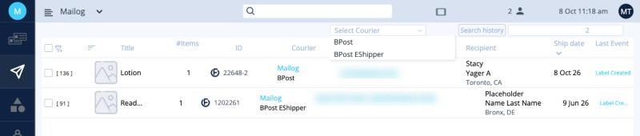
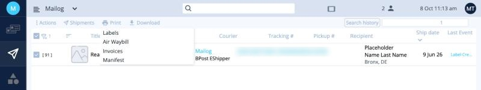
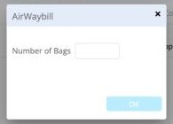
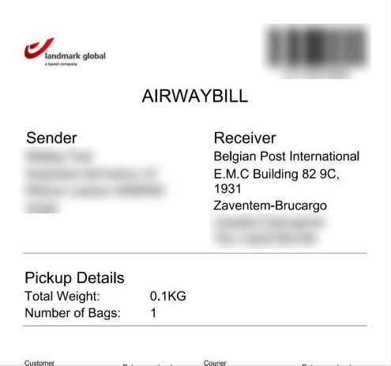
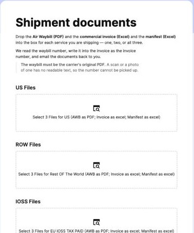
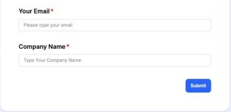

# מסמכי משלוח

אחרי שהפקתם את המדבקות, מכינים את מסמכי המשלוח לכל שירות ושולחים אותם ל-Mailog. העמוד הזה מתייחס ל**משלוח רגיל**. ב**אקספרס** המסמכים מופקים אוטומטית: ראו [משלוחי אקספרס](express.md#invoices-for-express).

## מה צריך, לכל שירות

לכל **שירות** שאתם שולחים היום (ארה״ב, שאר העולם, האיחוד האירופי עם IOSS) צריך שלושה מסמכים:

| מסמך | פורמט | מה זה |
|---|---|---|
| **Air Waybill‏ (AWB)** | PDF | מסמך ההובלה של השקיות של אותו שירות. **AWB אחד לכל שירות.** |
| **Invoices** | Excel | החשבונית המסחרית לכל המשלוחים של אותו שירות. |
| **Manifest** | Excel | רשימת כל החבילות של אותו שירות. |

!!! info "‏AWB אחד לכל שירות, בכל פעם ששולחים מסמכים"
    אין מגבלה יומית. אם אתם מכינים מסמכים פעמיים ביום, מפיקים AWB אחד לכל שירות בכל פעם.

## 1. בחירת המשלוחים של שירות אחד

1. היכנסו ל[משלוחים](shipments.md).
2. ב-**Select Courier** בחרו שירות אחד, למשל **BPost**. יוצגו רק המשלוחים של אותו שירות. הרשימה מופיעה כשיש משלוחים ביותר משירות אחד.
3. סמנו את התיבה ב**שורת הכותרת** כדי לבחור את כולם.

<button class="hotspot" style="left:67.5%;top:22.4%" data-tip="בחרו שירות אחד">1</button>
<button class="hotspot" style="left:10.5%;top:34.7%" data-tip="בחירת כל המשלוחים המוצגים">2</button>

## 2. הדפסת שלושת המסמכים

לחצו על **Print** בסרגל הכלים והפיקו כל מסמך:

<button class="hotspot" style="left:37.5%;top:46%" data-tip="Air Waybill‏ (PDF)">1</button>
<button class="hotspot" style="left:37.5%;top:56.7%" data-tip="Invoices‏ (Excel)">2</button>
<button class="hotspot" style="left:37.5%;top:66.7%" data-tip="Manifest‏ (Excel)">3</button>

1. **Air Waybill**: הזינו את **Number of Bags** (מספר השקיות) של השירות ולחצו על **OK**. ה-AWB נפתח כקובץ PDF. שמרו אותו.
2. **Invoices**: יורד קובץ Excel.
3. **Manifest**: יורד קובץ Excel.

אפשר להפיק אותם גם מיד אחרי **Create Labels**, מהתפריט **Print** שבסיכום. זה אותו דבר.

<figure markdown>
{ width="300" }
<figcaption>‏Air Waybill לדוגמה. הכתובות והמספרים מטושטשים.</figcaption>
</figure>

!!! danger "‏AWB על כל שקית"
    הדפיסו את ה-AWB **פעם אחת לכל שקית** של אותו שירות. הכניסו כל עותק ל**שקית ניילון שקופה** והדביקו אותה על השקית. אם יש לכם 3 שקיות לארה״ב, הדפיסו את ה-AWB של ארה״ב 3 פעמים. ראו גם [כללי השקיות](rules.md#bags).

חזרו על שלבים 1 ו-2 לכל שירות שאתם שולחים.

## 3. שליחת המסמכים

פתחו את הטופס **Shipment documents**:

[פתיחת טופס המסמכים](https://mailogs.retool.com/form/77869aa3-cb9e-4c44-b697-dd44f6d2ee67){ .md-button .md-button--primary }

<button class="hotspot" style="left:93%;top:48%" data-tip="ארה״ב: AWB + חשבונית + מניפסט">1</button>
<button class="hotspot" style="left:93%;top:72.7%" data-tip="שאר העולם">2</button>
<button class="hotspot" style="left:93%;top:93%" data-tip="האיחוד האירופי, IOSS (מע״מ שולם)">3</button>

1. לכל שירות שאתם שולחים, גררו את **3 הקבצים** שלו (AWB כ-PDF, חשבונית ומניפסט כ-Excel) לתיבה המתאימה: **US Files**,‏ **ROW Files** או **IOSS Files**. מלאו רק את התיבות שאתם צריכים.
2. הזינו את **Your Email** (המייל שלכם) ואת **Company Name** (שם החברה).
3. לחצו על **Submit**.

!!! warning "העלו את קובץ ה-AWB המקורי"
    העלו את קובץ ה-PDF של ה-AWB בדיוק כפי ש-Ordflow הפיקה אותו. סריקה או צילום של AWB מודפס לא ניתנים לקריאה, והטופס צריך את מספר ה-AWB.

‏Mailog קוראת את מספר ה-AWB, רושמת אותו בחשבונית כמספר החשבונית, ושולחת לכם את כל המסמכים במייל.

## 4. העברת המייל ל-Mailog

1. בדקו את המסמכים במייל שקיבלתם.
2. **העבירו (Forward) את המייל לכתובת [ops@mailogs.com](mailto:ops@mailogs.com).**

## 5. סימון המשלוחים כ-Complete {#mark-complete}

במסך [משלוחים](shipments.md), בחרו את המשלוחים ששלחתם ובחרו **Actions ‹ Complete**. הם עוברים ל[דוחות](reports.md), ורשימת המשלוחים פנויה למשלוחים הבאים.

!!! tip "רק אחרי שהעברתם את המייל"
    סמנו משלוחים כ-**Complete** רק אחרי שהעברתם את המסמכים ל-ops@mailogs.com.
