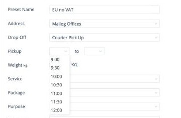
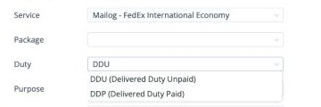
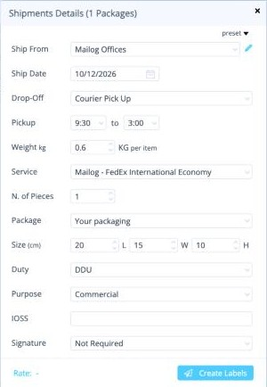
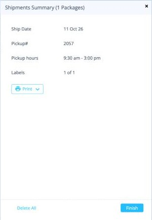
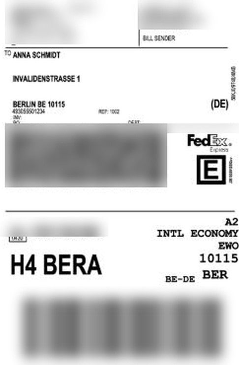
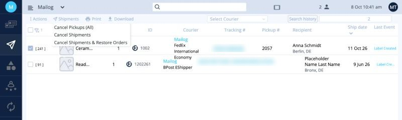
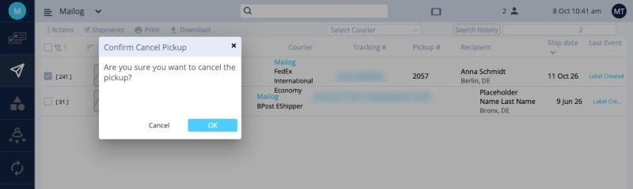

# משלוחי אקספרס

משלוחי אקספרס נשלחים עם **DHL Express**,‏ **FedEx International Priority** או **FedEx International Economy**. בשונה ממשלוח רגיל, שליח אוסף אותם מכם, או שאתם מוסרים אותם בנקודת מסירה של חברת השילוח.

השלבים זהים ל[הפקת מדבקות משלוח](create-labels.md). בעמוד הזה מוסבר מה שונה באקספרס.

!!! tip "מתי משתמשים באקספרס"
    השתמשו ב-**FedEx International Economy** בהזמנות לאיחוד האירופי שבהן המע״מ **לא** שולם בקופה. ראו [כללי משלוח](rules.md).

## יצירת פריסט לאקספרס

צרו פעם אחת פריסט לאקספרס ב[הגדרות ‹ משלוחים](../setup/presets.md). הדוגמה כאן היא הפריסט **EU no VAT**:

| שדה | מה לבחור |
|---|---|
| **Address** | הכתובת שממנה השליח אוסף. |
| **Drop-Off** | **Courier Pick Up** (השליח מגיע אליכם) או **Courier Location** (אתם מוסרים את החבילות). |
| **Pickup** | חלון הזמן לאיסוף. שעת התחלה בין 9:00 ל-12:00, שעת סיום בין 12:00 ל-3:00. איסופים זמינים החל מ-09:30. |
| **Service** | **FedEx International Economy**. |
| **Package** | **Your packaging**, עם המידות בס״מ. |
| **Duty** | **DDU**. ראו בהמשך. |
| **Purpose** | **Commercial**. |
| **Signature**,‏ **Insurance** | **Not Required**,‏ **None**. |

!!! info "Duty: ‏DDU או DDP"
    - **DDU** (Delivered Duty Unpaid): **המקבל** משלם את המסים. בחרו באפשרות הזו.
    - **DDP** (Delivered Duty Paid): **השולח** משלם את המסים.

## הפקת המדבקות

1. בחרו את ההזמנות ולחצו על **Ship**.
2. בחרו את **פריסט** האקספרס.
3. בדקו את **Ship Date**: זה היום שבו השליח מגיע. שנו אותו אם האיסוף לא היום.
4. בדקו את **N. of Pieces** (ראו בהמשך).
5. לחצו על **Create Labels**.

<button class="hotspot" style="left:95%;top:18.9%" data-tip="Ship Date = יום האיסוף">1</button>
<button class="hotspot" style="left:96%;top:25.1%" data-tip="Courier Pick Up">2</button>
<button class="hotspot" style="left:66%;top:31.6%" data-tip="חלון זמן לאיסוף">3</button>
<button class="hotspot" style="left:47%;top:50.2%" data-tip="מספר הקרטונים">4</button>
<button class="hotspot" style="left:96%;top:69.6%" data-tip="Duty: ‏DDU">5</button>

!!! warning "N. of Pieces: מדבקה לכל קרטון"
    **N. of Pieces** הוא מספר הקרטונים. ברירת המחדל היא **1**. אם ההזמנה נשלחת ביותר מקרטון אחד, הזינו את מספר הקרטונים: תקבלו מדבקה נפרדת לכל קרטון.

!!! note "השדה IOSS"
    ביעדים באיחוד האירופי שדה המע״מ נקרא **IOSS**. בהזמנות שבהן המע״מ לא שולם, הוא נשאר ריק.

## חשבוניות באקספרס {#invoices-for-express}

באקספרס כל מסמכי המשלוח מופקים אוטומטית. בעת הפקת המדבקות אפשר גם **לצרף חשבונית משלכם** כקובץ PDF. אם לא תצרפו, Ordflow תפיק חשבונית בשבילכם.

## הסיכום: מספר האיסוף

אחרי **Create Labels** מוצגים בסיכום **Pickup#** (מספר ההזמנה אצל חברת השילוח) ו-**Pickup hours** (שעות האיסוף).

<button class="hotspot" style="left:62%;top:19.6%" data-tip="מספר הזמנת האיסוף">1</button>
<button class="hotspot" style="left:85%;top:26.3%" data-tip="חלון הזמן לאיסוף">2</button>

<figure markdown>
{ width="260" }
<figcaption>מדבקת FedEx לדוגמה. פרטי השולח והמעקב מטושטשים.</figcaption>
</figure>

ואז, כרגיל: **Print ‹ Labels**, מדביקים מדבקה על כל קרטון ולוחצים על **Finish**. המשלוח עובר ל[משלוחים](shipments.md), ומספר האיסוף מופיע בעמודה **Pickup #**.

## ביטול איסוף או משלוח אקספרס {#cancel-a-pickup-or-an-express-shipment}

במסך [משלוחים](shipments.md), סמנו את המשלוח ופתחו את התפריט **Shipments**. במשלוחי אקספרס עם איסוף יש אפשרות נוספת:

<button class="hotspot" style="left:34%;top:22.5%" data-tip="ביטול האיסוף בלבד">1</button>

| אפשרות | מה היא עושה |
|---|---|
| **Cancel Pickups (All)** | מבטלת **רק את האיסוף**. המדבקות נשארות בתוקף, כך שאפשר להזמין איסוף חדש או למסור את החבילות בעצמכם. |
| **Cancel Shipments** | מבטלת את המדבקות ואת ההזמנה. |
| **Cancel Shipments & Restore Orders** | מבטלת את המדבקות ומחזירה את ההזמנות ללוח. |

כל אפשרות מבקשת אישור. לחצו על **OK**.

