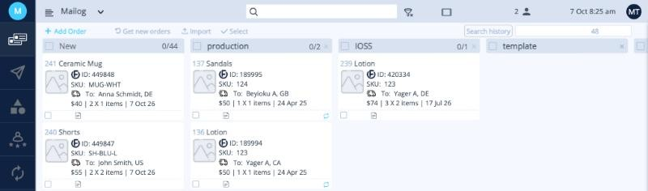
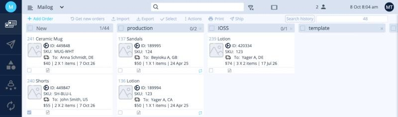

# לוח ההזמנות

לחצו על **Orders**, הסמל העליון בתפריט השמאלי, כדי לראות את ההזמנות שלכם. כל הזמנה מוצגת ככרטיס, והכרטיסים מסודרים בעמודות.

<button class="hotspot" style="left:9.5%;top:16.1%" data-tip="הוספת הזמנה ידנית">1</button>
<button class="hotspot" style="left:21%;top:16.1%" data-tip="משיכת ההזמנות האחרונות מהחנויות המחוברות">2</button>
<button class="hotspot" style="left:30.5%;top:16.1%" data-tip="ייבוא הזמנות מקובץ Excel או CSV">3</button>
<button class="hotspot" style="left:18%;top:23.7%" data-tip="New: לכאן נכנסות הזמנות חדשות">4</button>
<button class="hotspot" style="left:26.5%;top:69%" data-tip="כרטיס הזמנה. לחצו עליו כדי לפתוח את ההזמנה">5</button>

התצוגה הזו נקראת **Stages**. אפשר לעבור לתצוגת **Grid** ב[הגדרות ‹ הזמנות](../setup/orders.md).

## איך הזמנות נכנסות

| כפתור | מה הוא עושה |
|---|---|
| **+ Add Order** | יצירת הזמנה ידנית. |
| **Get new orders** | משיכת ההזמנות האחרונות מה[חנויות המחוברות](../setup/integrations.md). |
| **Import** | העלאת הזמנות מקובץ. ראו [ייבוא הזמנות מאקסל](import.md). |

הזמנות חדשות נכנסות לעמודה **New**.

## איך קוראים כרטיס הזמנה

| בכרטיס | משמעות |
|---|---|
| **מספר** (למעלה משמאל, למשל 240) | מספר ההזמנה הפנימי של Ordflow. |
| **כותרת** | שם הפריט. |
| **לוגו** | מאיפה ההזמנה הגיעה: הלוגו של החנות (למשל **E** של Etsy) או הלוגו של Ordflow להזמנות שנוצרו או יובאו ב-Ordflow. |
| **ID** | המזהה הפנימי של Ordflow. מספר ההזמנה שלכם מופיע כש[פותחים את ההזמנה](order-details.md). |
| **SKU** | מק״ט המוצר. |
| **To** | שם הנמען והמדינה. |
| **‎$55 \| 2 X 2 items \| 7 Oct 26** | ערך ההזמנה \| סך היחידות × מספר הפריטים השונים \| תאריך. |

## בחירת הזמנות

סמנו את התיבה בפינה השמאלית התחתונה של הכרטיס כדי לבחור את ההזמנה. בכותרת העמודה מופיע כמה הזמנות נבחרו, למשל **1/44**, ובסרגל הכלים מופיעים כפתורים נוספים.

<button class="hotspot" style="left:10.5%;top:95.8%" data-tip="סמנו כדי לבחור את ההזמנה">1</button>
<button class="hotspot" style="left:22%;top:24%" data-tip="מספר ההזמנות שנבחרו בעמודה">2</button>
<button class="hotspot" style="left:61.5%;top:16.1%" data-tip="Ship: הפקת מדבקות משלוח להזמנות שנבחרו">3</button>

| כפתור | מה הוא עושה |
|---|---|
| **Export** | הורדת ההזמנות שנבחרו כקובץ Excel. |
| **Select** | **Select all** (בחירת הכול), **Unselect all** (ביטול הבחירה), **Show Selected** (הצגת הנבחרות בלבד), **Show All** (הצגת הכול). |
| **Actions** | **Complete**,‏ **Archive** או **Delete** להזמנות שנבחרו. |
| **Print** | **Orders**: קובץ PDF של ההזמנות שנבחרו. **Orders Slips**: תעודות אריזה. |
| **Ship** | פתיחת חלונית המשלוח ל[הפקת מדבקות](create-labels.md). |

!!! warning "בהשלמה"
    למה משמש **+ Add Stage**, ומתי משתמשים ב-Complete וב-Archive.

**הבא:** [פרטי הזמנה ←](order-details.md)
