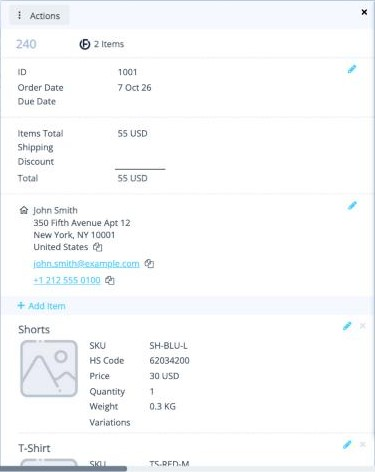
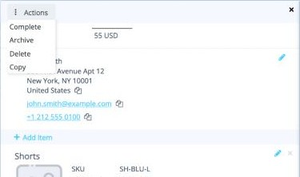

# פרטי הזמנה

לחצו על כרטיס הזמנה כדי לפתוח את ההזמנה בחלונית מימין. לחצו על **×** כדי לסגור אותה.

<button class="hotspot" style="left:22%;top:3.2%" data-tip="Actions: ‏Complete, ‏Archive, ‏Delete, ‏Copy">1</button>
<button class="hotspot" style="left:42%;top:15%" data-tip="מספר ההזמנה שלכם">2</button>
<button class="hotspot" style="left:93%;top:15%" data-tip="עריכת פרטי ההזמנה">3</button>
<button class="hotspot" style="left:45%;top:37.5%" data-tip="סכום ההזמנה">4</button>
<button class="hotspot" style="left:93%;top:43.4%" data-tip="עריכת הכתובת של הנמען">5</button>
<button class="hotspot" style="left:27%;top:64.4%" data-tip="הוספת פריט להזמנה">6</button>
<button class="hotspot" style="left:87%;top:68.9%" data-tip="עריכה או הסרה של הפריט">7</button>

## מה יש בחלונית

| חלק | מה מוצג בו |
|---|---|
| **פרטי ההזמנה** | **ID** (מספר ההזמנה שלכם), **Order Date** (תאריך ההזמנה) ו-**Due Date** (תאריך יעד). |
| **סכומים** | **Items Total**,‏ **Shipping**,‏ **Discount** ו-**Total**. |
| **הנמען** | שם, כתובת, מייל וטלפון. לחצו על סמלי ההעתקה כדי להעתיק אותם. |
| **פריטים** | בלוק לכל פריט: **SKU**,‏ **HS Code**,‏ **Price**,‏ **Quantity**,‏ **Weight** ו-**Variations**. |

כדי לשנות משהו, לחצו על **העיפרון** שלידו. כדי להסיר פריט, לחצו על **×** שלידו. כדי להוסיף פריט, לחצו על **+ Add Item**.

!!! tip "תאריך יעד"
    כשעובר ה-**Due Date** של הזמנה, התאריך נצבע ב**אדום**.

## פעולות (Actions)

| פעולה | מה היא עושה |
|---|---|
| **Complete** | מסמנת את ההזמנה כגמורה. |
| **Archive** | מוציאה את ההזמנה מהלוח. |
| **Delete** | מוחקת את ההזמנה. |
| **Copy** | יוצרת עותק של ההזמנה. משתמשים בה כדי **לפצל הזמנה** לשתיים, למשל כדי להשאיר הזמנה לאיחוד האירופי מתחת למגבלת 150 אירו. ראו [כללי משלוח](rules.md#split-an-order). |

**הבא:** [הפקת מדבקות משלוח ←](create-labels.md)
