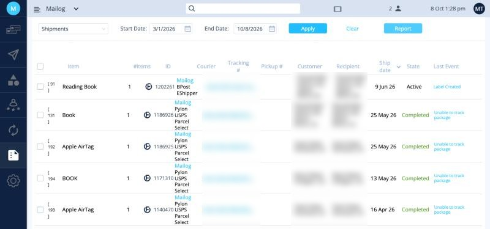
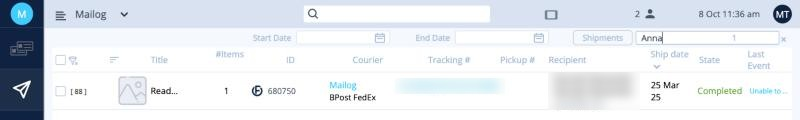
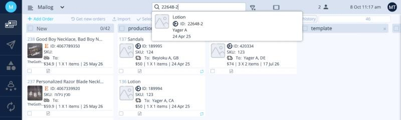

# Reports and history

Use reports and the history search to find an old shipment, reconcile your shipments, or see totals for a period.

## Run a report

Click **Reports** in the left menu.

<button class="hotspot" style="left:22.5%;top:12.5%" data-tip="Orders or Shipments">1</button>
<button class="hotspot" style="left:30%;top:18.5%" data-tip="Start date">2</button>
<button class="hotspot" style="left:47.5%;top:18.5%" data-tip="End date">3</button>
<button class="hotspot" style="left:62.5%;top:5%" data-tip="Apply: show the results">4</button>
<button class="hotspot" style="left:82%;top:5%" data-tip="Report: download as Excel">5</button>

1. In **Select Report**, choose:
    - **Orders**: all your orders, including orders you haven't shipped yet.
    - **Shipments**: all your shipments.
2. Choose a **Start Date** and an **End Date**.
3. Click **Apply**. The results appear below.
4. Click **Report** to download the results as an Excel file.

In the Shipments report, the **State** column shows whether a shipment is still **Active** (in [Shipments](shipments.md)) or **Completed** (you've [marked it Complete](documents.md#5-mark-the-shipments-as-complete)).

The Excel file has one row per shipment: title, quantity, sales channel, order ID, declared value, courier, tracking number, recipient, shipping date and shipping status.

!!! tip "Changing the report type clears the dates"
    Choose the report type first, then the dates.

## Search history

The **Search history** button on the **Shipments** page searches all your shipments, including completed ones.

1. Go to [Shipments](shipments.md) and click **Search history**.
2. Type part of a name, an order number or a tracking number, and press **Enter**. You can also set a **Start Date** and **End Date**.
3. To go back to your current shipments, click **Shipments**.

!!! note "Two search fields"
    - The search field next to **Search history** on the Shipments page filters only the shipments currently on screen.
    - The **Search history** page searches the full history.
    - Cancelled shipments aren't kept in history.

## Find an order

To find an order on the [orders board](index.md), type its order number in the search box at the top of the page. Matching orders appear in a list below the box.

