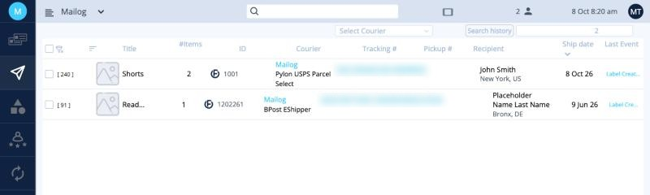
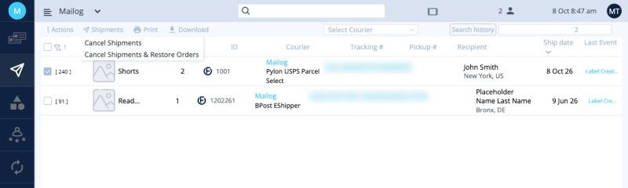
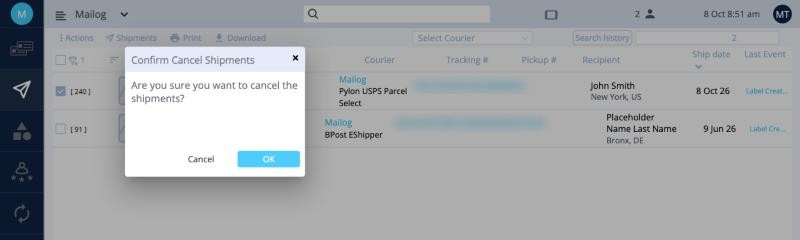

# משלוחים

אחרי לחיצה על **Finish**, ההזמנות עוברות ל-**Shipments**, הסמל השני בתפריט השמאלי. כאן אפשר לעקוב אחרי המשלוחים ולבטל מדבקות.

| עמודה | משמעות |
|---|---|
| **Title** | שם הפריט. |
| **#Items** | מספר הפריטים השונים. |
| **ID** | מספר ההזמנה שלכם. |
| **Courier** | השירות שבו הופקה המדבקה. |
| **Tracking #** | מספר המעקב. לחצו עליו כדי לעקוב אחרי החבילה. |
| **Pickup #** | מספר הזמנת האיסוף, באיסוף על ידי שליח. |
| **Recipient** | שם ועיר. |
| **Ship date** | היום שעבורו הופקה המדבקה. |
| **Last Event** | עדכון המעקב האחרון מחברת השילוח. |

!!! info "מיד אחרי הפקת המדבקה"
    עד שחברת השילוח סורקת את החבילה, ב-**Last Event** יופיע משהו כמו *Label Created* או *Shipment information received*. זה תקין: החבילה עדיין לא נסרקה.

## ביטול מדבקה

1. סמנו את התיבה ליד המשלוח.
2. לחצו על **Shipments** בסרגל הכלים ובחרו אחת מהאפשרויות שלמטה.
3. לחצו על **OK** כדי לאשר.

<button class="hotspot" style="left:34%;top:22.5%" data-tip="ביטול המדבקה וההזמנה">1</button>
<button class="hotspot" style="left:34%;top:28.8%" data-tip="ביטול המדבקה והחזרת ההזמנה ללוח">2</button>

| אפשרות | מתי משתמשים בה |
|---|---|
| **Cancel Shipments** | ההזמנה לא יוצאת בכלל. המדבקה וההזמנה מבוטלות. |
| **Cancel Shipments & Restore Orders** | צריך לשנות משהו ולשלוח מחדש, למשל הלקוח שינה כתובת. המדבקה מבוטלת וההזמנה חוזרת ללוח. |

!!! tip "משלוחי אקספרס עם איסוף על ידי שליח"
    יש להם אפשרות נוספת, **Cancel Pickups (All)**, שמבטלת רק את האיסוף. ראו [משלוחי אקספרס](express.md#cancel-a-pickup-or-an-express-shipment).

## ‏Complete

אחרי ששלחתם את המסמכים והעברתם אותם ל-ops@mailogs.com, בחרו את המשלוחים ובחרו **Actions ‹ Complete**. הם עוברים ל-**Reports**. ראו [מסמכי משלוח](documents.md#mark-complete).

**הבא:** [מסמכי משלוח ←](documents.md)
