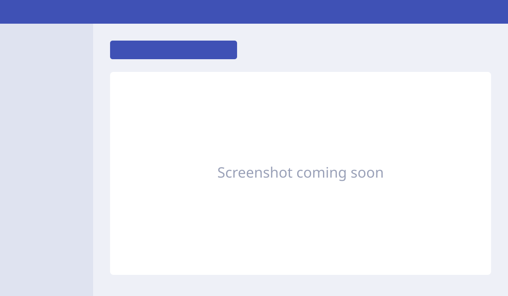

# Produce the paperwork

How to generate and print the documents that go with a shipment.

## Steps

1. Open the shipment in Ordflow.
2. Click **_Paperwork button name_**.
3. Choose the documents to print.
4. Print them.

<button class="hotspot" style="left:34%;top:17%" data-tip="Open the paperwork menu">1</button>

## Which documents per service

| Document | Express | Postal (Center) | Postal (outside Center) |
|---|:-:|:-:|:-:|
| _e.g. Manifest_ | | | |
| _e.g. Delivery note_ | | | |

!!! warning "To be completed"
    Fill in the real button names, the screenshot and the documents needed for each service.

**Next:** [Where to route the paperwork →](paperwork-routing.md)
