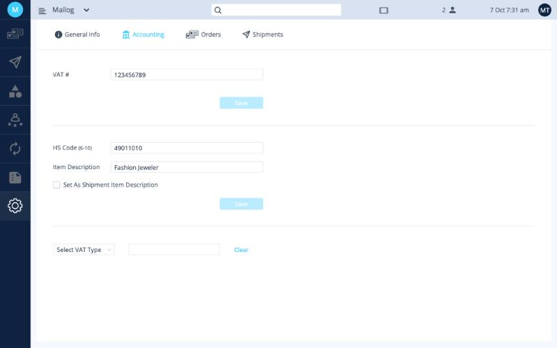
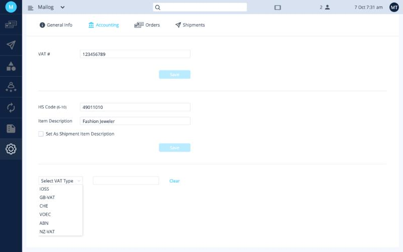

# Accounting

**Settings › Accounting** holds your tax details and, if you want it, one customs description for all your shipments.

<button class="hotspot" style="left:7.1%;top:21.4%" data-tip="Your VAT number (עוסק מורשה or ח״פ)">1</button>
<button class="hotspot" style="left:7.1%;top:42.4%" data-tip="Default HS code and customs description">2</button>
<button class="hotspot" style="left:7.1%;top:53.2%" data-tip="Tick to use this description on all shipments">3</button>
<button class="hotspot" style="left:7.1%;top:71.6%" data-tip="VAT numbers from your sales channels (IOSS and others)">4</button>

## VAT number

Enter your Israeli **VAT number**: your מספר עוסק מורשה, or your ח״פ if you're a company. Click **Save**.

## Default customs description (optional)

Your sales channels (Etsy, Shopify and others) send each item's product title to Ordflow. Product titles are often long, full of keywords, or not suitable for a customs form. You can replace them on **all** your shipments with one customs description and HS code.

!!! success "Use this if everything you ship is the same kind of product"
    For example, **plastic beads**, whether red, blue or any other color. One description, *Plastic beads*, correctly describes every shipment.

!!! failure "Don't use it if you ship different kinds of products"
    For example, **socks and chairs**. One description can't cover both, and a wrong customs description can get a shipment held or returned.

**To set it up:**

1. Enter the **HS Code** (6 to 10 digits).
2. Enter the **Item Description**, for example *Plastic beads*.
3. Tick **Set As Shipment Item Description**.
4. Click **Save**.

## VAT types (IOSS and others)

Some marketplaces collect VAT from the buyer at checkout. Etsy, for example, does this for EU orders and gives you an **IOSS number**. Enter these numbers here so they're included with your shipments.

<button class="hotspot" style="left:7.1%;top:71.6%" data-tip="Choose the VAT type">1</button>
<button class="hotspot" style="left:31%;top:71.6%" data-tip="Enter the number you got from your sales channel">2</button>

1. Choose the **VAT type** from the list.
2. Enter the number next to it.

You can store several numbers, one for each VAT type you need. Get the numbers from your sales channel (Etsy, Shopify and so on).

| VAT type | Used for shipments to |
|---|---|
| IOSS | European Union |
| GB-VAT | United Kingdom |
| CHE | Switzerland |
| VOEC | Norway |
| ABN | Australia |
| NZ-VAT | New Zealand |

**Next:** [Orders settings →](orders.md)
