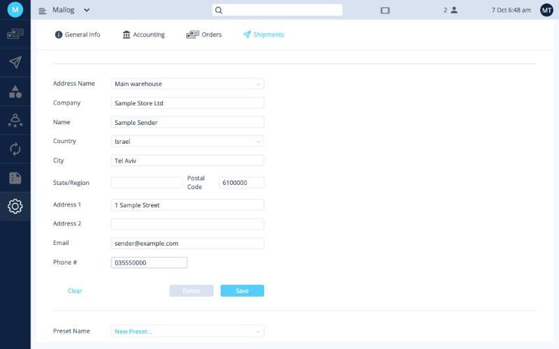

# כתובות שולח

כתובת השולח היא המקום שממנו יוצאות החבילות, ושממנו השליח אוסף אותן. אפשר לשמור כמה כתובות, למשל המחסן והמשרד.

כתובות השולח נמצאות בלשונית **Settings ‹ Shipments**.

## הוספת כתובת

1. לחצו על השדה **Address Name** ובחרו **New Address...**.
2. לחצו שוב על השדה והקלידו כינוי קצר לכתובת, למשל *Main warehouse*. הכינוי מיועד רק לכם, כדי להבחין בין הכתובות.
3. מלאו את השדות המסומנים בכוכבית אדומה **\***.
4. לחצו על **Save**. הכפתור הופך לפעיל אחרי שכל שדות החובה מולאו.

<button class="hotspot" style="left:7.1%;top:23.8%" data-tip="כינוי לכתובת">1</button>
<button class="hotspot" style="left:7.1%;top:40.4%" data-tip="הקלידו את שם המדינה ובחרו אותה מהרשימה">2</button>
<button class="hotspot" style="left:7.1%;top:75.2%" data-tip="מספר טלפון לשליח">3</button>
<button class="hotspot" style="left:43.3%;top:83.2%" data-tip="שמירת הכתובת">4</button>

| שדה | חובה |
|---|:-:|
| **Address Name** (כינוי) | ✅ |
| **Company** (שם החברה) | ✅ |
| **Name** (איש קשר) | ✅ |
| **Country** (מדינה) | ✅ |
| **City** (עיר) | ✅ |
| **State/Region** (מחוז) | |
| **Postal Code** (מיקוד) | ✅ |
| **Address 1** (כתובת) | ✅ |
| **Address 2** (המשך כתובת) | |
| **Email** (מייל) | ✅ |
| **Phone #** (טלפון) | ✅ |

!!! tip "מלאו את הכתובת באנגלית"
    הכתובת מודפסת על מדבקות המשלוח ועל מסמכי המכס, ולכן יש למלא אותה באותיות לועזיות.

אחרי השמירה הכתובת מופיעה ברשימה **Address Name**:

## שינוי או מחיקה של כתובת

בחרו את הכתובת ברשימה **Address Name**, בצעו את השינויים ולחצו על **Save**, או לחצו על **Delete** כדי למחוק אותה.

**הבא:** [פריסטים ←](presets.md)
