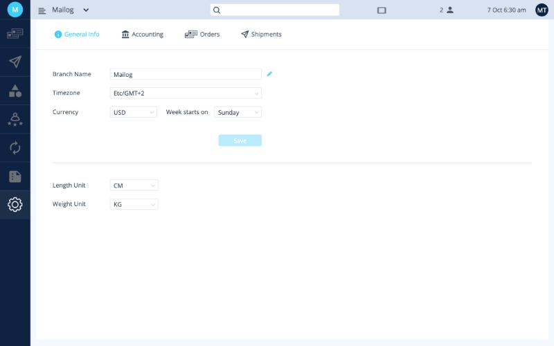

# הגדרות ראשוניות

עושים את זה פעם אחת, לפני שליחת ההזמנה הראשונה. זה לוקח בערך רבע שעה.

## רשימת משימות להגדרה

עברו על השלבים לפי הסדר. כל שלב מקשר לעמוד עם צילומי מסך.

- [ ] **בדקו את הפרטים הבסיסיים:** שם הסניף, אזור זמן, מטבע, יחידות מידה. [פרטים כלליים ←](general-info.md)
- [ ] **הזינו מספר עוסק מורשה או ח״פ.** [הנהלת חשבונות ←](accounting.md#vat-number)
- [ ] **הוסיפו את מספרי המע״מ מערוצי המכירה** (למשל מספר ה-IOSS של Etsy). [הנהלת חשבונות ←](accounting.md#vat-types-ioss)
- [ ] **ודאו שישראל נמצאת במסנן המדינות**, כדי שהזמנות מקומיות לא ייכנסו למערכת. [הגדרות הזמנות ←](orders.md)
- [ ] **הוסיפו כתובת שולח.** [כתובות שולח ←](addresses.md)
- [ ] **צרו פריסטים למשלוח** (ארה״ב, אירופה, שאר העולם). [פריסטים ←](presets.md)
- [ ] **חברו את החנות שלכם** (Etsy, Shopify ועוד). [חיבורים ←](integrations.md)

אופציונלי:

- [ ] להחליף את שמות המוצרים בתיאור מכס אחיד. [הנהלת חשבונות ←](accounting.md#customs-description)
- [ ] לשלוח מספרי מעקב לחנות באופן אוטומטי. [הגדרות משלוחים ←](shipment-settings.md#autocomplete)
- [ ] לסנן פריטים חינמיים כמו כרטיסי תודה. [הגדרות משלוחים ←](shipment-settings.md#filter-sku)

## איפה נמצאות ההגדרות

כל ההגדרות נמצאות תחת **סמל גלגל השיניים** בתחתית התפריט השמאלי. במסך ההגדרות יש ארבע לשוניות: **General Info**,‏ **Accounting**,‏ **Orders** ו-**Shipments**. לחיבורים (**Integrations**) יש סמל נפרד בתפריט השמאלי.

<button class="hotspot" style="left:2.7%;top:59%" data-tip="הגדרות: סמל גלגל השיניים בתפריט השמאלי">1</button>
<button class="hotspot" style="left:2.7%;top:42.6%" data-tip="חיבורים: חיבור החנות והשליחויות">2</button>
<button class="hotspot" style="left:7.1%;top:9.8%" data-tip="ארבע הלשוניות של מסך ההגדרות">3</button>

!!! info "שירותי המשלוח שלכם"
    שירותי המשלוח שזמינים לכם (למשל FedEx,‏ DHL,‏ Bpost או Pylon) מופעלים על ידי Mailog בעת פתיחת החשבון. אם חסר לכם שירות, [פנו לתמיכה](mailto:info@ordflow.com).
