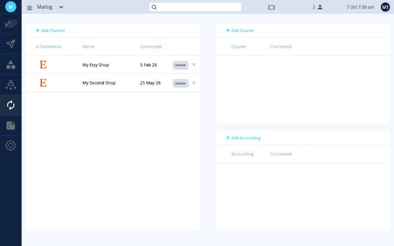
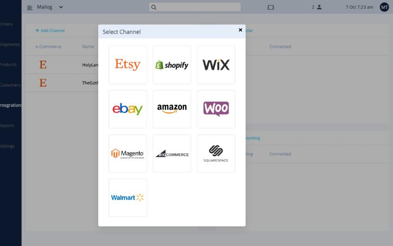
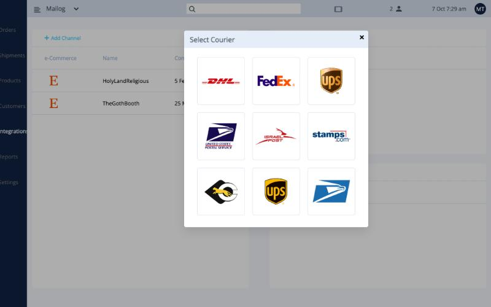
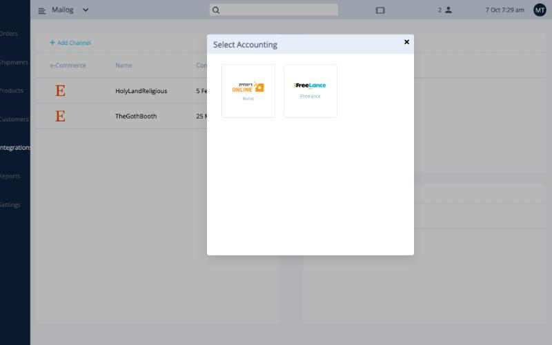

# חיבורים

חברו את החנות שלכם כדי שההזמנות ממנה ייכנסו ל-Ordflow באופן אוטומטי. לחצו על **Integrations** בתפריט השמאלי.

<button class="hotspot" style="left:6.5%;top:12.4%" data-tip="חיבור ערוץ מכירה">1</button>
<button class="hotspot" style="left:45.7%;top:26.2%" data-tip="רענון החיבור">2</button>
<button class="hotspot" style="left:51.3%;top:26.2%" data-tip="ניתוק החנות">3</button>
<button class="hotspot" style="left:55.5%;top:12.4%" data-tip="חיבור חשבון שליחויות משלכם">4</button>
<button class="hotspot" style="left:55.5%;top:56%" data-tip="חיבור תוכנת הנהלת חשבונות (בטא)">5</button>

## חיבור החנות

1. לחצו על **+ Add Channel**.
2. בחרו את ערוץ המכירה.
3. תועברו לאתר של ערוץ המכירה. התחברו ואשרו ל-Ordflow גישה לחנות.
4. תוחזרו ל-Ordflow, והחנות תופיע ברשימה יחד עם תאריך החיבור.

ערוצי המכירה הזמינים: Etsy,‏ Shopify,‏ WIX,‏ eBay,‏ Amazon,‏ WooCommerce,‏ Magento 2,‏ BigCommerce,‏ Squarespace ו-Walmart.

אפשר לחבר יותר מחנות אחת.

| כפתור | מה הוא עושה |
|---|---|
| **Update** | מרענן ברקע את החיבור לחנות. השתמשו בו אם הזמנות הפסיקו להגיע. |
| **×** | מנתק את החנות. הזמנות שכבר נמצאות ב-Ordflow נשארות. |

## חשבון שליחויות משלכם {#your-own-courier-account}

אם יש לכם **חשבון משלכם** אצל חברת שילוח (למשל חשבון FedEx או DHL שלכם), חברו אותו דרך **+ Add Courier**. אם אתם שולחים דרך השירותים של Mailog, אין צורך בזה.

חברות השילוח הזמינות: DHL,‏ FedEx,‏ UPS,‏ USPS,‏ דואר ישראל,‏ Stamps.com,‏ צ׳יטה,‏ UPS ישראל ו-Ordflow USPS.

## תוכנת הנהלת חשבונות (בטא)

!!! note "בטא"
    זו אפשרות חדשה ועשויה להשתנות.

דרך **+ Add Accounting** אפשר לחבר את תוכנת הנהלת החשבונות שלכם: **ריווחית Online** או **iFreelance**.

!!! success "סיימתם את ההגדרות"
    אתם מוכנים לשלוח. חזרו ל[רשימת ההגדרות](index.md) כדי לוודא שלא פספסתם שום שלב.
