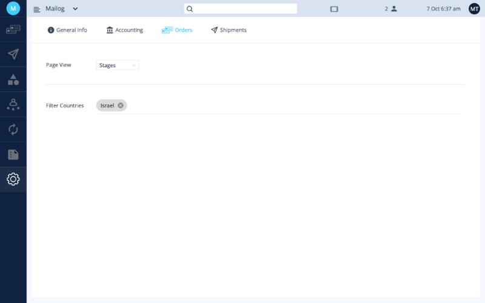
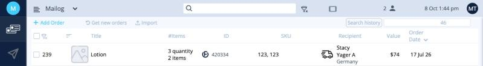

# הגדרות הזמנות

בלשונית **Settings ‹ Orders** קובעים איך נראה מסך ההזמנות ואילו הזמנות Ordflow מושכת מהחנות.

<button class="hotspot" style="left:7.1%;top:21.4%" data-tip="תצוגת עמוד: Stages או Grid">1</button>
<button class="hotspot" style="left:7.1%;top:34.8%" data-tip="סינון מדינות: הזמנות למדינות האלה לא נמשכות למערכת">2</button>

## תצוגת עמוד

בשדה **Page View** בוחרים איך יוצגו ההזמנות במסך **Orders**:‏ **Stages** או **Grid**.

השינוי נשמר מיד.

=== "Stages"

    ההזמנות מוצגות ככרטיסים בעמודות (שלבים). ראו [לוח ההזמנות](../orders/index.md#stages).

    

=== "Grid"

    ההזמנות מוצגות כשורות בטבלה: שם, מספר פריטים, מזהה, מק״ט, נמען, ערך ותאריך הזמנה.

    

## סינון מדינות

הזמנות שנשלחות למדינות שברשימה **Filter Countries** **לא נמשכות ל-Ordflow** מערוצי המכירה.

!!! tip "השאירו את ישראל ברשימה"
    Mailog לא מבצעת משלוחים בתוך ישראל, ולכן הזמנות מקומיות לא צריכות להיכנס ל-Ordflow. **Israel** צריכה להיות ברשימה תמיד.

כדי להוסיף מדינה, לחצו על השדה ובחרו אותה. כדי להסיר מדינה, לחצו על **⊗** שלידה.

**הבא:** [הגדרות משלוחים ←](shipment-settings.md)
