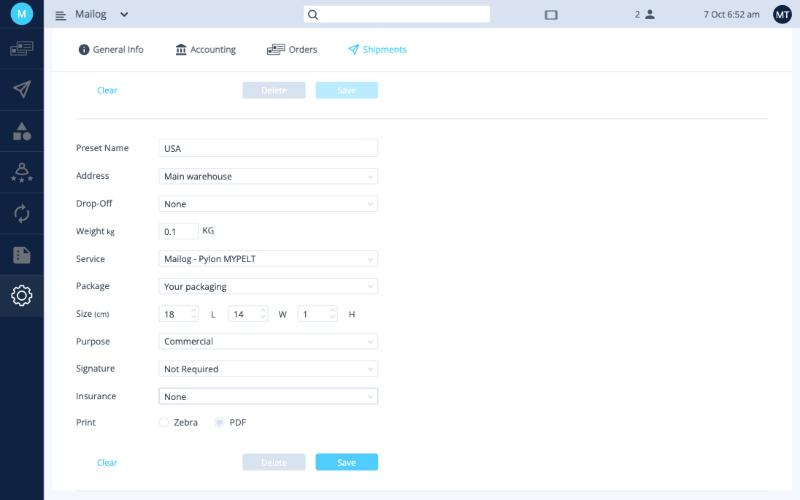
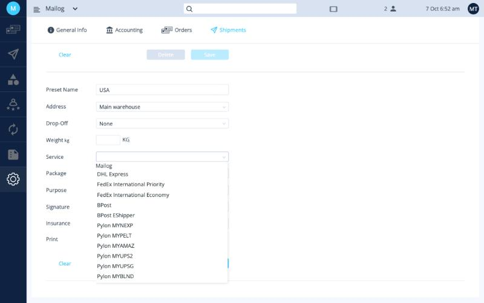

# Presets

A preset is a saved set of shipping choices: sender address, service, package, customs purpose and so on. You pick a preset when you create shipping labels, so you don't have to fill in the same details for every order. You can also select several orders and create labels for all of them with one preset.

Presets are in **Settings › Shipments**, below the sender addresses.

## Recommended presets

Most sellers need three presets:

| Preset | For orders to | Service |
|---|---|---|
| **USA** | United States | Pylon MYPELT |
| **EU** | European Union, VAT paid at checkout | BPost EShipper |
| **ROW** | Rest of the world | BPost |

## Create a preset

1. Click the **Preset Name** field and choose **New Preset...**.
2. Click the field again and type a name, for example *USA*.
3. Fill in the fields (see the table below), in order from top to bottom.
4. Click **Save**.

<button class="hotspot" style="left:7.1%;top:29.6%" data-tip="Preset name, for example USA">1</button>
<button class="hotspot" style="left:7.1%;top:35.2%" data-tip="Your sender address">2</button>
<button class="hotspot" style="left:7.1%;top:40.8%" data-tip="None for Standard services; required for Express">3</button>
<button class="hotspot" style="left:7.1%;top:51.6%" data-tip="Shipping service">4</button>
<button class="hotspot" style="left:7.1%;top:62.6%" data-tip="Package size in cm, when using your own packaging">5</button>
<button class="hotspot" style="left:43.3%;top:92.4%" data-tip="Save the preset">6</button>

| Field | What to choose |
|---|---|
| **Address** | Your [sender address](addresses.md). |
| **Drop-Off** | How the parcels get to the carrier. See [Drop-off](#drop-off) below. |
| **Weight** | A typical parcel weight in kg. |
| **Service** | The shipping service. Choose **Address** and **Drop-Off** first, or the list won't open. |
| **Package** | **Your packaging**, then enter the size (length × width × height, in cm). |
| **Purpose** | **Commercial** if you're selling the goods. |
| **Signature** | **Not Required**, unless you need proof of delivery. |
| **Insurance** | **None**, unless the shipment is high value. |
| **Print** | Leave the default. |

## Express and Standard services

| Type | Services | Drop-off |
|---|---|---|
| **Express** | DHL Express, FedEx International Priority, FedEx International Economy | **Required**: Courier Pick Up or Courier Location |
| **Standard** (non-Express) | All other services (BPost, BPost EShipper, Pylon…) | **None** |

The services you can choose are switched on by Mailog when your account is created.

## Drop-off

| Option | Meaning |
|---|---|
| **None** | For Standard services. |
| **Courier Pick Up** | A courier collects the parcels from your sender address. When you choose this, a **Pickup** time window appears. Express pickups are available from 09:30 until the end of the day. |
| **Courier Location** | You drop the parcels off at a carrier location yourself. |

## Change a saved preset

Choose the preset in the **Preset Name** list and click the **blue pencil** next to it to edit it. Then click **Save**.

!!! warning "To be completed"
    Rules for creating labels for several orders at once.

**Next:** [Integrations →](integrations.md)
