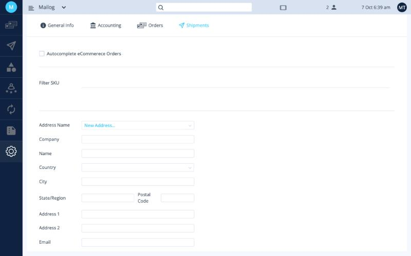

# Shipment settings

**Settings › Shipments** has four parts: two options at the top, then your [sender addresses](addresses.md) and your [presets](presets.md).

<button class="hotspot" style="left:7.1%;top:20.8%" data-tip="Send tracking back to your store automatically">1</button>
<button class="hotspot" style="left:7.1%;top:32.4%" data-tip="SKUs that are never pulled into Ordflow">2</button>
<button class="hotspot" style="left:7.1%;top:48.8%" data-tip="Sender addresses">3</button>

## Autocomplete eCommerce Orders

When this box is ticked, Ordflow updates your store after you create a shipping label: the order is marked as **shipped** and the **tracking number** is sent back to your sales channel (Etsy, Shopify and so on).

## Filter SKU

Items with the SKUs in this list are **not pulled into Ordflow**.

!!! example
    You add a free *Thank you* card to every order, and it has its own SKU in your shop. The card is free and shouldn't be shipped or declared as an item, so add its SKU here.

**Next:** [Sender addresses →](addresses.md)
